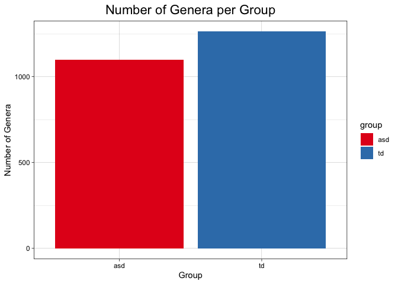
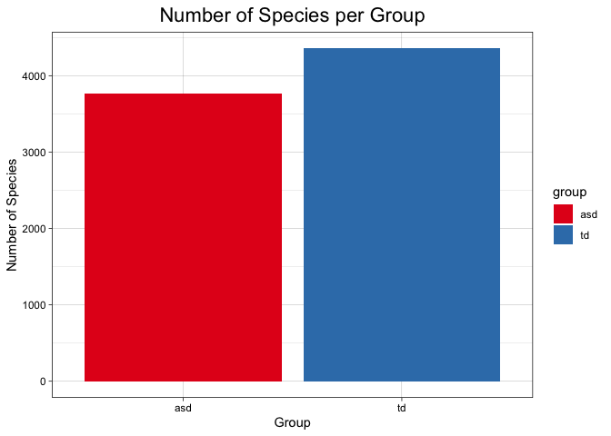

## Load the libraries

```r
library(tidyverse)
library(janitor)
library(here)
library(naniar)
```

## Load the Data

```r
asd <- readr::read_csv("ASD_meta_abundance_2.csv")
asd
```

```
## # A tibble: 5,619 x 61
##    Taxonomy       A3    A5    A6    A9   A31   A51   A52   A53   A54   A59   A67
##    <chr>       <dbl> <dbl> <dbl> <dbl> <dbl> <dbl> <dbl> <dbl> <dbl> <dbl> <dbl>
##  1 g__Faecali…  4988  5060  2905  5745  4822  3889  4646  6337  5064  6359  3194
##  2 g__Hungate…  5803  5612  4109  1432  2652  4175  3891   894  4903  2970  4029
##  3 g__Clostri…  3793  2795  1355  5558  5383  3505  5541  4429  4121  3258  1901
##  4 g__Butyric…    64  1385   725  1553    40    53    33   175    58  1636  1170
##  5 g__Alistip…    15    20   723   620  3261    43    83    37    43  1114  2531
##  6 g__Unclass…   100    29    11  1320    51    45    52    64    60   896    26
##  7 g__Clostri…  2119  1230  1322  2675  1470  2262  2984  2004  1904  1227   821
##  8 g__Unclass…    12    24     1    44    26     9    25    19    17    17    15
##  9 g__Lachnoc…   453   691  2278   107   342  1304  1400  1207  2034  2051    20
## 10 g__Butyric…  1266  1682    43  1726  1804  1441  2691  1886   919  2215  1063
## # … with 5,609 more rows, and 49 more variables: A68 <dbl>, A69 <dbl>,
## #   A71 <dbl>, A73 <dbl>, A76 <dbl>, A78 <dbl>, A87 <dbl>, A89 <dbl>,
## #   A93 <dbl>, A101 <dbl>, A109 <dbl>, A113 <dbl>, A114 <dbl>, A115 <dbl>,
## #   A142 <dbl>, A144 <dbl>, A149 <dbl>, A164 <dbl>, A165 <dbl>, B1 <dbl>,
## #   B2 <dbl>, B3 <dbl>, B5 <dbl>, B6 <dbl>, B7 <dbl>, B8 <dbl>, B13 <dbl>,
## #   B14 <dbl>, B28 <dbl>, B29 <dbl>, B36 <dbl>, B37 <dbl>, B94 <dbl>,
## #   B99 <dbl>, B103 <dbl>, B106 <dbl>, B111 <dbl>, B114 <dbl>, B115 <dbl>,
## #   B120 <dbl>, B127 <dbl>, B132 <dbl>, B141 <dbl>, B142 <dbl>, B143 <dbl>,
## #   B152 <dbl>, B156 <dbl>, B158 <dbl>, B164 <dbl>
```


## Tidying the Data

```r
asd_tidy <- asd %>% 
  pivot_longer(-Taxonomy, 
               names_to = "subject", 
               values_to = "abundance") %>% 
  separate(subject, into = c("group", "number"), sep = 1)
asd_tidy
```

```
## # A tibble: 337,140 x 4
##    Taxonomy                                            group number abundance
##    <chr>                                               <chr> <chr>      <dbl>
##  1 g__Faecalibacterium;s__Faecalibacterium prausnitzii A     3           4988
##  2 g__Faecalibacterium;s__Faecalibacterium prausnitzii A     5           5060
##  3 g__Faecalibacterium;s__Faecalibacterium prausnitzii A     6           2905
##  4 g__Faecalibacterium;s__Faecalibacterium prausnitzii A     9           5745
##  5 g__Faecalibacterium;s__Faecalibacterium prausnitzii A     31          4822
##  6 g__Faecalibacterium;s__Faecalibacterium prausnitzii A     51          3889
##  7 g__Faecalibacterium;s__Faecalibacterium prausnitzii A     52          4646
##  8 g__Faecalibacterium;s__Faecalibacterium prausnitzii A     53          6337
##  9 g__Faecalibacterium;s__Faecalibacterium prausnitzii A     54          5064
## 10 g__Faecalibacterium;s__Faecalibacterium prausnitzii A     59          6359
## # … with 337,130 more rows
```


## Remove unidentified bacteria

```r
asd_tidy2 <- asd_tidy %>% 
  filter(str_detect(Taxonomy, "Unclassified") == FALSE)
asd_tidy2
```

```
## # A tibble: 279,720 x 4
##    Taxonomy                                            group number abundance
##    <chr>                                               <chr> <chr>      <dbl>
##  1 g__Faecalibacterium;s__Faecalibacterium prausnitzii A     3           4988
##  2 g__Faecalibacterium;s__Faecalibacterium prausnitzii A     5           5060
##  3 g__Faecalibacterium;s__Faecalibacterium prausnitzii A     6           2905
##  4 g__Faecalibacterium;s__Faecalibacterium prausnitzii A     9           5745
##  5 g__Faecalibacterium;s__Faecalibacterium prausnitzii A     31          4822
##  6 g__Faecalibacterium;s__Faecalibacterium prausnitzii A     51          3889
##  7 g__Faecalibacterium;s__Faecalibacterium prausnitzii A     52          4646
##  8 g__Faecalibacterium;s__Faecalibacterium prausnitzii A     53          6337
##  9 g__Faecalibacterium;s__Faecalibacterium prausnitzii A     54          5064
## 10 g__Faecalibacterium;s__Faecalibacterium prausnitzii A     59          6359
## # … with 279,710 more rows
```

## Tidy up the Taxonomy column

```r
asd_tidy3 <- 
  asd_tidy2 %>% 
  separate(Taxonomy, into = c("genus", "species"), sep = ";")
```

## Tidy up the species and genus and number columns

```r
asd_tidy4 <-
  asd_tidy3 %>% 
  separate(genus, into = c("g", "genus"), sep = "__") %>% 
  separate(species, into = c("s", "species"), sep = "__") %>% 
  select( -g, -s) %>% 
  rename(id = "number")
asd_tidy4
```

```
## # A tibble: 279,720 x 5
##    genus            species                      group id    abundance
##    <chr>            <chr>                        <chr> <chr>     <dbl>
##  1 Faecalibacterium Faecalibacterium prausnitzii A     3          4988
##  2 Faecalibacterium Faecalibacterium prausnitzii A     5          5060
##  3 Faecalibacterium Faecalibacterium prausnitzii A     6          2905
##  4 Faecalibacterium Faecalibacterium prausnitzii A     9          5745
##  5 Faecalibacterium Faecalibacterium prausnitzii A     31         4822
##  6 Faecalibacterium Faecalibacterium prausnitzii A     51         3889
##  7 Faecalibacterium Faecalibacterium prausnitzii A     52         4646
##  8 Faecalibacterium Faecalibacterium prausnitzii A     53         6337
##  9 Faecalibacterium Faecalibacterium prausnitzii A     54         5064
## 10 Faecalibacterium Faecalibacterium prausnitzii A     59         6359
## # … with 279,710 more rows
```


## Make genus and species and id into factors

```r
asd_tidy4$genus <- as.factor(asd_tidy4$genus)
asd_tidy4$species <- as.factor(asd_tidy4$species)
asd_tidy4$id <- as.factor(asd_tidy4$id)
```


## Break it into an ASD and TD groups

```r
asd_group <-
  asd_tidy4 %>% 
  filter(group == "B")
asd_group
```

```
## # A tibble: 139,860 x 5
##    genus            species                      group id    abundance
##    <fct>            <fct>                        <chr> <fct>     <dbl>
##  1 Faecalibacterium Faecalibacterium prausnitzii B     1          4269
##  2 Faecalibacterium Faecalibacterium prausnitzii B     2          4397
##  3 Faecalibacterium Faecalibacterium prausnitzii B     3          4499
##  4 Faecalibacterium Faecalibacterium prausnitzii B     5          6126
##  5 Faecalibacterium Faecalibacterium prausnitzii B     6          7020
##  6 Faecalibacterium Faecalibacterium prausnitzii B     7          5404
##  7 Faecalibacterium Faecalibacterium prausnitzii B     8          4404
##  8 Faecalibacterium Faecalibacterium prausnitzii B     13         5811
##  9 Faecalibacterium Faecalibacterium prausnitzii B     14         3360
## 10 Faecalibacterium Faecalibacterium prausnitzii B     28         4141
## # … with 139,850 more rows
```


```r
td_group <-
  asd_tidy4 %>% 
  filter(group == "A")
td_group
```

```
## # A tibble: 139,860 x 5
##    genus            species                      group id    abundance
##    <fct>            <fct>                        <chr> <fct>     <dbl>
##  1 Faecalibacterium Faecalibacterium prausnitzii A     3          4988
##  2 Faecalibacterium Faecalibacterium prausnitzii A     5          5060
##  3 Faecalibacterium Faecalibacterium prausnitzii A     6          2905
##  4 Faecalibacterium Faecalibacterium prausnitzii A     9          5745
##  5 Faecalibacterium Faecalibacterium prausnitzii A     31         4822
##  6 Faecalibacterium Faecalibacterium prausnitzii A     51         3889
##  7 Faecalibacterium Faecalibacterium prausnitzii A     52         4646
##  8 Faecalibacterium Faecalibacterium prausnitzii A     53         6337
##  9 Faecalibacterium Faecalibacterium prausnitzii A     54         5064
## 10 Faecalibacterium Faecalibacterium prausnitzii A     59         6359
## # … with 139,850 more rows
```

## Preliminary Analysis of TD and ASD groups

```r
td_diversity <- td_group %>% 
  filter(abundance != 0) %>% 
  summarize(n_genus = n_distinct(genus), n_species = n_distinct(species))
td_diversity
```

```
## # A tibble: 1 x 2
##   n_genus n_species
##     <int>     <int>
## 1    1263      4357
```


```r
asd_diversity <-
asd_group %>% 
  filter(abundance != 0) %>% 
  summarize(n_genus = n_distinct(genus), n_species = n_distinct(species))
asd_diversity
```

```
## # A tibble: 1 x 2
##   n_genus n_species
##     <int>     <int>
## 1    1100      3763
```
<<<<<<< HEAD
Note: The TD Group has greater diversity than the ASD group. 

## Plot the diversity of the ASD vs TD groups

```r
group <- c("td", "asd")
microbiome_diversity <-
  full_join(td_diversity, asd_diversity) %>% 
  cbind(group) %>% 
  select(group, n_genus, n_species)
```

```
## Joining, by = c("n_genus", "n_species")
```

```r
microbiome_diversity
```

```
##   group n_genus n_species
## 1    td    1263      4357
## 2   asd    1100      3763
```

Here is the genus diversity:

```r
microbiome_diversity %>% 
  ggplot(aes(x = group, y = n_genus, fill = group)) +
  geom_col() +
  theme_linedraw() +
  labs(title = "Number of Genera per Group",
       x = "Group",
       y = "Number of Genera") +
  theme(plot.title = element_text(size = rel(1.5), hjust = 0.5)) +
  scale_fill_brewer(palette = "Set1")
```

<!-- -->

Here is the species diversity:

```r
microbiome_diversity %>% 
  ggplot(aes(x = group, y = n_species, fill = group)) +
  geom_col() +
  theme_linedraw() +
  labs(title = "Number of Species per Group",
       x = "Group",
       y = "Number of Species") +
  theme(plot.title = element_text(size = rel(1.5), hjust = 0.5)) +
  scale_fill_brewer(palette = "Set1")
```

<!-- -->

## Exporting CSVs

```r
write.csv(asd_tidy4, file = "microbiome.csv", row.names = FALSE)
```


```r
write.csv(asd_group, file = "asd_group.csv", row.names = FALSE)
```


```r
write.csv(td_group, file = "td_group.csv", row.names = FALSE)
```

## Splitting up Claire's tidy Data

```r
tidier_microbiome <- readr::read_csv("/Users/allyandre/Desktop/BIS15L_Project_Group11/tidy_data/tidiermicrobiome.csv")
```

```
## 
## ── Column specification ────────────────────────────────────────────────────────
## cols(
##   genus = col_character(),
##   species = col_character(),
##   strain = col_character(),
##   condition = col_character(),
##   patient_id = col_double(),
##   abundance = col_double(),
##   cultured = col_logical()
## )
```

```r
tidier_microbiome
```

```
## # A tibble: 279,720 x 7
##    genus            species     strain condition patient_id abundance cultured
##    <chr>            <chr>       <chr>  <chr>          <dbl>     <dbl> <lgl>   
##  1 Faecalibacterium prausnitzii <NA>   a                  3      4988 TRUE    
##  2 Faecalibacterium prausnitzii <NA>   a                  5      5060 TRUE    
##  3 Faecalibacterium prausnitzii <NA>   a                  6      2905 TRUE    
##  4 Faecalibacterium prausnitzii <NA>   a                  9      5745 TRUE    
##  5 Faecalibacterium prausnitzii <NA>   a                 31      4822 TRUE    
##  6 Faecalibacterium prausnitzii <NA>   a                 51      3889 TRUE    
##  7 Faecalibacterium prausnitzii <NA>   a                 52      4646 TRUE    
##  8 Faecalibacterium prausnitzii <NA>   a                 53      6337 TRUE    
##  9 Faecalibacterium prausnitzii <NA>   a                 54      5064 TRUE    
## 10 Faecalibacterium prausnitzii <NA>   a                 59      6359 TRUE    
## # … with 279,710 more rows
```


```r
asd_group_tidier <- 
  tidier_microbiome %>% 
  filter(condition =="b")
asd_group_tidier
```

```
## # A tibble: 139,860 x 7
##    genus            species     strain condition patient_id abundance cultured
##    <chr>            <chr>       <chr>  <chr>          <dbl>     <dbl> <lgl>   
##  1 Faecalibacterium prausnitzii <NA>   b                  1      4269 TRUE    
##  2 Faecalibacterium prausnitzii <NA>   b                  2      4397 TRUE    
##  3 Faecalibacterium prausnitzii <NA>   b                  3      4499 TRUE    
##  4 Faecalibacterium prausnitzii <NA>   b                  5      6126 TRUE    
##  5 Faecalibacterium prausnitzii <NA>   b                  6      7020 TRUE    
##  6 Faecalibacterium prausnitzii <NA>   b                  7      5404 TRUE    
##  7 Faecalibacterium prausnitzii <NA>   b                  8      4404 TRUE    
##  8 Faecalibacterium prausnitzii <NA>   b                 13      5811 TRUE    
##  9 Faecalibacterium prausnitzii <NA>   b                 14      3360 TRUE    
## 10 Faecalibacterium prausnitzii <NA>   b                 28      4141 TRUE    
## # … with 139,850 more rows
```


```r
td_group_tidier <-
  tidier_microbiome %>% 
  filter(condition == "a")
td_group_tidier
```

```
## # A tibble: 139,860 x 7
##    genus            species     strain condition patient_id abundance cultured
##    <chr>            <chr>       <chr>  <chr>          <dbl>     <dbl> <lgl>   
##  1 Faecalibacterium prausnitzii <NA>   a                  3      4988 TRUE    
##  2 Faecalibacterium prausnitzii <NA>   a                  5      5060 TRUE    
##  3 Faecalibacterium prausnitzii <NA>   a                  6      2905 TRUE    
##  4 Faecalibacterium prausnitzii <NA>   a                  9      5745 TRUE    
##  5 Faecalibacterium prausnitzii <NA>   a                 31      4822 TRUE    
##  6 Faecalibacterium prausnitzii <NA>   a                 51      3889 TRUE    
##  7 Faecalibacterium prausnitzii <NA>   a                 52      4646 TRUE    
##  8 Faecalibacterium prausnitzii <NA>   a                 53      6337 TRUE    
##  9 Faecalibacterium prausnitzii <NA>   a                 54      5064 TRUE    
## 10 Faecalibacterium prausnitzii <NA>   a                 59      6359 TRUE    
## # … with 139,850 more rows
```


```r
write.csv(td_group_tidier, file = "td_group_tidier.csv", row.names = FALSE)
```


```r
write.csv(asd_group_tidier, file = "asd_group_tidier.csv", row.names = FALSE)
```


##Tidy Demographics Info


```r
demographics <- readr::read_csv("/Users/allyandre/Desktop/BIS15L_Project_Group11/untidy_data/demographics.csv")
```

```
## 
## ── Column specification ────────────────────────────────────────────────────────
## cols(
##   `Sample ID` = col_character(),
##   Stage = col_character(),
##   Gender = col_character(),
##   Age = col_double(),
##   `16S RNA sequencing` = col_character(),
##   `Metagenomic sequencing` = col_character(),
##   `Metabonomic analysis` = col_character(),
##   Constipation = col_character()
## )
```

```r
demographics
```

```
## # A tibble: 289 x 8
##    `Sample ID` Stage Gender   Age `16S RNA sequencing` `Metagenomic sequencing`
##    <chr>       <chr> <chr>  <dbl> <chr>                <chr>                   
##  1 A1          TD    Female     5 yes                  No                      
##  2 A10         TD    Female     5 yes                  No                      
##  3 A100        TD    Male       5 yes                  No                      
##  4 A101        TD    Male       3 yes                  Yes                     
##  5 A102        TD    Male       4 yes                  No                      
##  6 A104        TD    Male       6 yes                  No                      
##  7 A105        TD    Male       5 yes                  No                      
##  8 A106        TD    Male       4 yes                  No                      
##  9 A108        TD    Male       3 yes                  No                      
## 10 A109        TD    Male       4 yes                  Yes                     
## # … with 279 more rows, and 2 more variables: Metabonomic analysis <chr>,
## #   Constipation <chr>
```


```r
demographics2 <-
  demographics %>% 
  clean_names() %>% 
  filter(metagenomic_sequencing == "Yes") %>% 
  select(sample_id, gender, age)
demographics2
```

```
## # A tibble: 60 x 3
##    sample_id gender   age
##    <chr>     <chr>  <dbl>
##  1 A101      Male       3
##  2 A109      Male       4
##  3 A113      Male       6
##  4 A114      Male       4
##  5 A115      Male       5
##  6 A142      Male       7
##  7 A144      Male       9
##  8 A149      Male       5
##  9 A164      Male       8
## 10 A165      Male       7
## # … with 50 more rows
```


```r
write.csv(demographics2, file = "demographics_tidy.csv", row.names = FALSE)
```


