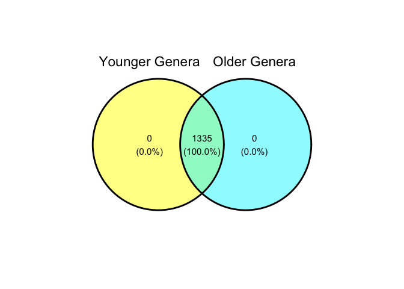

## Load the libraries

```r
library(tidyverse)
library(janitor)
library(here)
library(naniar)
library(ggvenn)
library(VennDiagram)
```

## Load the Data

```r
tidier_microbiome <- readr::read_csv("/Users/allyandre/Desktop/BIS15L_Project_Group11/tidy_data/tidiermicrobiome.csv")
```

```
## 
## ── Column specification ────────────────────────────────────────────────────────
## cols(
##   genus = col_character(),
##   species = col_character(),
##   strain = col_character(),
##   condition = col_character(),
##   patient_id = col_double(),
##   abundance = col_double(),
##   cultured = col_logical()
## )
```

```r
tidier_microbiome
```

```
## # A tibble: 279,720 x 7
##    genus            species     strain condition patient_id abundance cultured
##    <chr>            <chr>       <chr>  <chr>          <dbl>     <dbl> <lgl>   
##  1 Faecalibacterium prausnitzii <NA>   a                  3      4988 TRUE    
##  2 Faecalibacterium prausnitzii <NA>   a                  5      5060 TRUE    
##  3 Faecalibacterium prausnitzii <NA>   a                  6      2905 TRUE    
##  4 Faecalibacterium prausnitzii <NA>   a                  9      5745 TRUE    
##  5 Faecalibacterium prausnitzii <NA>   a                 31      4822 TRUE    
##  6 Faecalibacterium prausnitzii <NA>   a                 51      3889 TRUE    
##  7 Faecalibacterium prausnitzii <NA>   a                 52      4646 TRUE    
##  8 Faecalibacterium prausnitzii <NA>   a                 53      6337 TRUE    
##  9 Faecalibacterium prausnitzii <NA>   a                 54      5064 TRUE    
## 10 Faecalibacterium prausnitzii <NA>   a                 59      6359 TRUE    
## # … with 279,710 more rows
```

```r
asd_tidier <- readr::read_csv("/Users/allyandre/Desktop/BIS15L_Project_Group11/tidy_data/asd_group_tidier.csv")
```

```
## 
## ── Column specification ────────────────────────────────────────────────────────
## cols(
##   genus = col_character(),
##   species = col_character(),
##   strain = col_character(),
##   condition = col_character(),
##   patient_id = col_double(),
##   abundance = col_double(),
##   cultured = col_logical()
## )
```

```r
asd_tidier
```

```
## # A tibble: 139,860 x 7
##    genus            species     strain condition patient_id abundance cultured
##    <chr>            <chr>       <chr>  <chr>          <dbl>     <dbl> <lgl>   
##  1 Faecalibacterium prausnitzii <NA>   b                  1      4269 TRUE    
##  2 Faecalibacterium prausnitzii <NA>   b                  2      4397 TRUE    
##  3 Faecalibacterium prausnitzii <NA>   b                  3      4499 TRUE    
##  4 Faecalibacterium prausnitzii <NA>   b                  5      6126 TRUE    
##  5 Faecalibacterium prausnitzii <NA>   b                  6      7020 TRUE    
##  6 Faecalibacterium prausnitzii <NA>   b                  7      5404 TRUE    
##  7 Faecalibacterium prausnitzii <NA>   b                  8      4404 TRUE    
##  8 Faecalibacterium prausnitzii <NA>   b                 13      5811 TRUE    
##  9 Faecalibacterium prausnitzii <NA>   b                 14      3360 TRUE    
## 10 Faecalibacterium prausnitzii <NA>   b                 28      4141 TRUE    
## # … with 139,850 more rows
```


```r
td_tidier <- readr::read_csv("/Users/allyandre/Desktop/BIS15L_Project_Group11/tidy_data/td_group_tidier.csv")
```

```
## 
## ── Column specification ────────────────────────────────────────────────────────
## cols(
##   genus = col_character(),
##   species = col_character(),
##   strain = col_character(),
##   condition = col_character(),
##   patient_id = col_double(),
##   abundance = col_double(),
##   cultured = col_logical()
## )
```

```r
td_tidier
```

```
## # A tibble: 139,860 x 7
##    genus            species     strain condition patient_id abundance cultured
##    <chr>            <chr>       <chr>  <chr>          <dbl>     <dbl> <lgl>   
##  1 Faecalibacterium prausnitzii <NA>   a                  3      4988 TRUE    
##  2 Faecalibacterium prausnitzii <NA>   a                  5      5060 TRUE    
##  3 Faecalibacterium prausnitzii <NA>   a                  6      2905 TRUE    
##  4 Faecalibacterium prausnitzii <NA>   a                  9      5745 TRUE    
##  5 Faecalibacterium prausnitzii <NA>   a                 31      4822 TRUE    
##  6 Faecalibacterium prausnitzii <NA>   a                 51      3889 TRUE    
##  7 Faecalibacterium prausnitzii <NA>   a                 52      4646 TRUE    
##  8 Faecalibacterium prausnitzii <NA>   a                 53      6337 TRUE    
##  9 Faecalibacterium prausnitzii <NA>   a                 54      5064 TRUE    
## 10 Faecalibacterium prausnitzii <NA>   a                 59      6359 TRUE    
## # … with 139,850 more rows
```

## Prepare data for Venn diagram

```r
td_venn <-
  td_tidier %>% 
  rename(genus_td = "genus") %>% 
  filter(abundance != 0) %>% 
  select(genus_td, patient_id)
```


```r
asd_venn <-
  asd_tidier %>% 
  rename(genus_asd = "genus") %>% 
  filter(abundance != 0)
```


```r
both_venn <- full_join(td_venn, asd_venn, by = "patient_id")
both_venn
```

```
## # A tibble: 19,470,923 x 8
##    genus_td   patient_id genus_asd  species  strain condition abundance cultured
##    <chr>           <dbl> <chr>      <chr>    <chr>  <chr>         <dbl> <lgl>   
##  1 Faecaliba…          3 Faecaliba… prausni… <NA>   b              4499 TRUE    
##  2 Faecaliba…          3 Hungatella hathewa… <NA>   b              2325 TRUE    
##  3 Faecaliba…          3 Clostridi… <NA>     <NA>   b              3842 FALSE   
##  4 Faecaliba…          3 Butyricim… virosa   <NA>   b               703 TRUE    
##  5 Faecaliba…          3 Alistipes  indisti… <NA>   b               819 TRUE    
##  6 Faecaliba…          3 Clostridi… <NA>     CAG:7  b              1504 TRUE    
##  7 Faecaliba…          3 Lachnoclo… asparag… <NA>   b              2208 TRUE    
##  8 Faecaliba…          3 Butyricic… <NA>     <NA>   b              2209 FALSE   
##  9 Faecaliba…          3 Oscilliba… <NA>     ER4    b               193 TRUE    
## 10 Faecaliba…          3 Desulfovi… piger    <NA>   b                 3 TRUE    
## # … with 19,470,913 more rows
```


```r
both_venn$genus_td <- as.factor(both_venn$genus_td)
both_venn$genus_asd <- as.factor(both_venn$genus_asd)
```


```r
both_venn2 <- 
  both_venn %>% 
  filter(genus_td != "NA" | genus_asd != "NA")
```


## Build Venn Diagram


```r
venn_data <- list(
  "TD Genera" = both_venn2$genus_td,
  "ASD Genera" = both_venn2$genus_asd
)
```


```r
ggvenn(venn_data, fill_color = c("yellow", "turquoise1"))
```

<!-- -->

## Try to build a COOLER (aka to-scale) venn diagram


```r
anyNA(venn_data)
```

```
## [1] FALSE
```


```r
grid.newpage()
draw.pairwise.venn(area1 = 1264,                      
                   area2 = 1101,
                   cross.area = 1068, 
                   fill = c("yellow", "turquoise1"), 
                   category = c("TD Genera", "ASD Genera"))
```

<!-- -->

```
## (polygon[GRID.polygon.25], polygon[GRID.polygon.26], polygon[GRID.polygon.27], polygon[GRID.polygon.28], text[GRID.text.29], text[GRID.text.30], lines[GRID.lines.31], text[GRID.text.32], text[GRID.text.33], text[GRID.text.34])
```


## Bargraphs of number of genera unique to each group


```r
unique_names <- c("TD group", "ASD Group")
unique_counts <- c(196, 33)
unique_genera <- data_frame(unique_names, unique_counts)
```

```
## Warning: `data_frame()` was deprecated in tibble 1.1.0.
## Please use `tibble()` instead.
```

```r
unique_genera
```

```
## # A tibble: 2 x 2
##   unique_names unique_counts
##   <chr>                <dbl>
## 1 TD group               196
## 2 ASD Group               33
```


```r
unique_genera %>% 
  ggplot(aes(x = unique_names, y = unique_counts, fill = unique_names)) +
  geom_col(color = "black") + 
  scale_fill_manual(values = c("turquoise1", "yellow")) +
  theme_linedraw() +
  labs(title = "Number of Unique Genera Per Group",
       x = NULL,
       y = "Unique Genera") +
  theme(plot.title = element_text(size = rel(1.5), hjust = 0.5)) 
```

<!-- -->

#Prep data for Venn Diagram by Gender
##Capitalize A and B

```r
both_venn$condition <- str_to_upper(both_venn$condition, locale = "en")
```

## Wrangle the data so they have enough in common to join them together
### Abundance Data

```r
asd <- readr::read_csv("ASD_meta_abundance_2.csv")
```

```
## 
## ── Column specification ────────────────────────────────────────────────────────
## cols(
##   .default = col_double(),
##   Taxonomy = col_character()
## )
## ℹ Use `spec()` for the full column specifications.
```

```r
asd
```

```
## # A tibble: 5,619 x 61
##    Taxonomy       A3    A5    A6    A9   A31   A51   A52   A53   A54   A59   A67
##    <chr>       <dbl> <dbl> <dbl> <dbl> <dbl> <dbl> <dbl> <dbl> <dbl> <dbl> <dbl>
##  1 g__Faecali…  4988  5060  2905  5745  4822  3889  4646  6337  5064  6359  3194
##  2 g__Hungate…  5803  5612  4109  1432  2652  4175  3891   894  4903  2970  4029
##  3 g__Clostri…  3793  2795  1355  5558  5383  3505  5541  4429  4121  3258  1901
##  4 g__Butyric…    64  1385   725  1553    40    53    33   175    58  1636  1170
##  5 g__Alistip…    15    20   723   620  3261    43    83    37    43  1114  2531
##  6 g__Unclass…   100    29    11  1320    51    45    52    64    60   896    26
##  7 g__Clostri…  2119  1230  1322  2675  1470  2262  2984  2004  1904  1227   821
##  8 g__Unclass…    12    24     1    44    26     9    25    19    17    17    15
##  9 g__Lachnoc…   453   691  2278   107   342  1304  1400  1207  2034  2051    20
## 10 g__Butyric…  1266  1682    43  1726  1804  1441  2691  1886   919  2215  1063
## # … with 5,609 more rows, and 49 more variables: A68 <dbl>, A69 <dbl>,
## #   A71 <dbl>, A73 <dbl>, A76 <dbl>, A78 <dbl>, A87 <dbl>, A89 <dbl>,
## #   A93 <dbl>, A101 <dbl>, A109 <dbl>, A113 <dbl>, A114 <dbl>, A115 <dbl>,
## #   A142 <dbl>, A144 <dbl>, A149 <dbl>, A164 <dbl>, A165 <dbl>, B1 <dbl>,
## #   B2 <dbl>, B3 <dbl>, B5 <dbl>, B6 <dbl>, B7 <dbl>, B8 <dbl>, B13 <dbl>,
## #   B14 <dbl>, B28 <dbl>, B29 <dbl>, B36 <dbl>, B37 <dbl>, B94 <dbl>,
## #   B99 <dbl>, B103 <dbl>, B106 <dbl>, B111 <dbl>, B114 <dbl>, B115 <dbl>,
## #   B120 <dbl>, B127 <dbl>, B132 <dbl>, B141 <dbl>, B142 <dbl>, B143 <dbl>,
## #   B152 <dbl>, B156 <dbl>, B158 <dbl>, B164 <dbl>
```

```r
asd2 <- 
  asd %>% 
  pivot_longer(-Taxonomy, 
               names_to = "subject", 
               values_to = "abundance") %>% 
  filter(str_detect(Taxonomy, "Unclassified") == FALSE) %>% 
  separate(Taxonomy, into = c("genus", "species"), sep = ";") %>% 
  separate(genus, into = c("g", "genus"), sep = "__") %>% 
  separate(species, into = c("s", "species"), sep = "__") %>% 
  select( -g, -s, -species) %>% 
  rename(sample_id = "subject")
asd2
```

```
## # A tibble: 279,720 x 3
##    genus            sample_id abundance
##    <chr>            <chr>         <dbl>
##  1 Faecalibacterium A3             4988
##  2 Faecalibacterium A5             5060
##  3 Faecalibacterium A6             2905
##  4 Faecalibacterium A9             5745
##  5 Faecalibacterium A31            4822
##  6 Faecalibacterium A51            3889
##  7 Faecalibacterium A52            4646
##  8 Faecalibacterium A53            6337
##  9 Faecalibacterium A54            5064
## 10 Faecalibacterium A59            6359
## # … with 279,710 more rows
```

###Demographics data

```r
demographics <- readr::read_csv("/Users/allyandre/Desktop/BIS15L_Project_Group11/untidy_data/demographics.csv")
```

```
## 
## ── Column specification ────────────────────────────────────────────────────────
## cols(
##   `Sample ID` = col_character(),
##   Stage = col_character(),
##   Gender = col_character(),
##   Age = col_double(),
##   `16S RNA sequencing` = col_character(),
##   `Metagenomic sequencing` = col_character(),
##   `Metabonomic analysis` = col_character(),
##   Constipation = col_character()
## )
```

```r
demographics
```

```
## # A tibble: 289 x 8
##    `Sample ID` Stage Gender   Age `16S RNA sequencing` `Metagenomic sequencing`
##    <chr>       <chr> <chr>  <dbl> <chr>                <chr>                   
##  1 A1          TD    Female     5 yes                  No                      
##  2 A10         TD    Female     5 yes                  No                      
##  3 A100        TD    Male       5 yes                  No                      
##  4 A101        TD    Male       3 yes                  Yes                     
##  5 A102        TD    Male       4 yes                  No                      
##  6 A104        TD    Male       6 yes                  No                      
##  7 A105        TD    Male       5 yes                  No                      
##  8 A106        TD    Male       4 yes                  No                      
##  9 A108        TD    Male       3 yes                  No                      
## 10 A109        TD    Male       4 yes                  Yes                     
## # … with 279 more rows, and 2 more variables: Metabonomic analysis <chr>,
## #   Constipation <chr>
```


```r
demographics2 <-
  demographics %>% 
  clean_names() %>% 
  filter(metagenomic_sequencing == "Yes") %>% 
  select(sample_id, gender, age)
demographics2
```

```
## # A tibble: 60 x 3
##    sample_id gender   age
##    <chr>     <chr>  <dbl>
##  1 A101      Male       3
##  2 A109      Male       4
##  3 A113      Male       6
##  4 A114      Male       4
##  5 A115      Male       5
##  6 A142      Male       7
##  7 A144      Male       9
##  8 A149      Male       5
##  9 A164      Male       8
## 10 A165      Male       7
## # … with 50 more rows
```

##Join the two dataframes

```r
demo_venn <- full_join(asd2, demographics2, by = "sample_id") %>% 
  select(-c(sample_id, abundance, age))
demo_venn
```

```
## # A tibble: 279,720 x 2
##    genus            gender
##    <chr>            <chr> 
##  1 Faecalibacterium Female
##  2 Faecalibacterium Male  
##  3 Faecalibacterium Female
##  4 Faecalibacterium Male  
##  5 Faecalibacterium Male  
##  6 Faecalibacterium Male  
##  7 Faecalibacterium Male  
##  8 Faecalibacterium Male  
##  9 Faecalibacterium Male  
## 10 Faecalibacterium Male  
## # … with 279,710 more rows
```

```r
demo_abundance <- full_join(asd2, demographics2, by = "sample_id")
```


```r
write.csv(demo_abundance, file = "demographics_and_abundance.csv", row.names = FALSE)
```


##Divide the genera by gender

```r
demo_venn_f <- 
  demo_venn %>% 
  filter(gender == "Female") %>% 
  rename(genus_f = "genus")
demo_venn_f
```

```
## # A tibble: 18,648 x 2
##    genus_f          gender
##    <chr>            <chr> 
##  1 Faecalibacterium Female
##  2 Faecalibacterium Female
##  3 Faecalibacterium Female
##  4 Faecalibacterium Female
##  5 Hungatella       Female
##  6 Hungatella       Female
##  7 Hungatella       Female
##  8 Hungatella       Female
##  9 Clostridium      Female
## 10 Clostridium      Female
## # … with 18,638 more rows
```

```r
demo_venn_m <-
  demo_venn %>% 
  filter(gender == "Male") %>% 
  rename(genus_m = "genus")
demo_venn_m
```

```
## # A tibble: 261,072 x 2
##    genus_m          gender
##    <chr>            <chr> 
##  1 Faecalibacterium Male  
##  2 Faecalibacterium Male  
##  3 Faecalibacterium Male  
##  4 Faecalibacterium Male  
##  5 Faecalibacterium Male  
##  6 Faecalibacterium Male  
##  7 Faecalibacterium Male  
##  8 Faecalibacterium Male  
##  9 Faecalibacterium Male  
## 10 Faecalibacterium Male  
## # … with 261,062 more rows
```


```r
demo_venn_f$genus_f <- as.factor(demo_venn_f$genus_f)
demo_venn_m$genus_m <- as.factor(demo_venn_m$genus_m)
```

#Venn diagrams of overlap by gender
##Not-to=Scale Venn Diagram

```r
demo_venn_data <- list(
  "Male Genera" = demo_venn_m$genus_m,
  "Female Genera" = demo_venn_f$genus_f
)
```


```r
ggvenn(demo_venn_data, fill_color = c("yellow", "turquoise1"))
```

<!-- -->
## To-Scale Venn Diagram

```r
grid.newpage()
draw.pairwise.venn(area1 = 1335,                      
                   area2 = 1335,
                   cross.area = 1335, 
                   fill = c("yellow", "turquoise1"), 
                   category = c("Male Genera", "Female Genera"))
```

<!-- -->

```
## (polygon[GRID.polygon.117], polygon[GRID.polygon.118], text[GRID.text.119], text[GRID.text.120], text[GRID.text.121], text[GRID.text.122], text[GRID.text.123])
```
## Venn Diagram by Age Group

```r
age_venn <- full_join(asd2, demographics2, by = "sample_id") %>% 
  select(-c(sample_id, abundance, gender)) %>% 
  mutate(age = case_when(age <= 7 ~ "younger",
                         age > 7 ~ "older"))
age_venn$genus <- as.factor(age_venn$genus)
age_venn_y <-
  age_venn %>% 
  filter(age == "younger") %>% 
  rename(genus_y = "genus")

age_venn_o <-
  age_venn %>% 
  filter(age == "older") %>% 
  rename(genus_o = "genus")
```


```r
age_venn_data <- list(
  "Younger Genera" = age_venn_y$genus_y,
  "Older Genera" = age_venn_o$genus_o
)
```


```r
ggvenn(age_venn_data, fill_color = c("yellow", "turquoise1"))
```

<!-- -->


