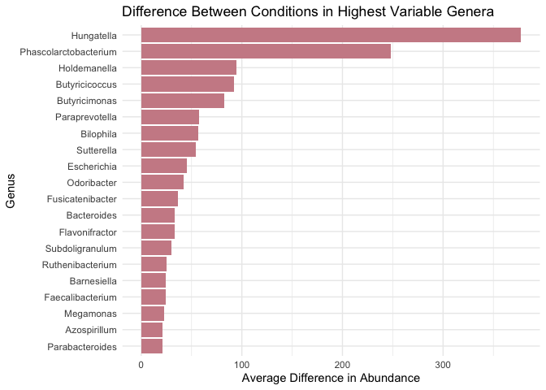
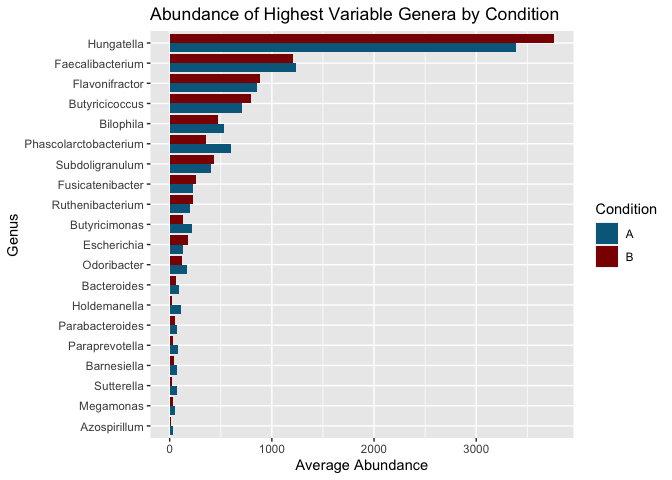
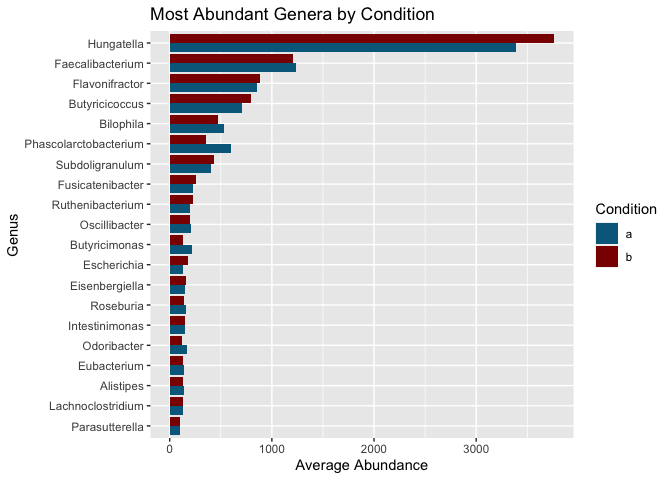
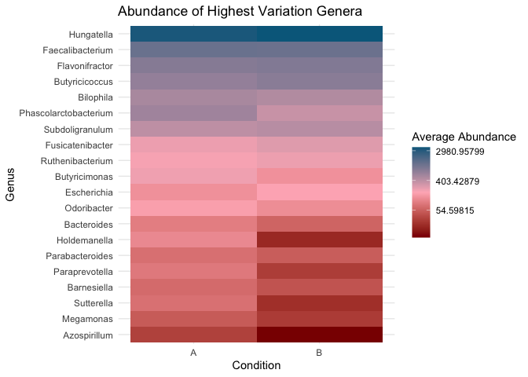
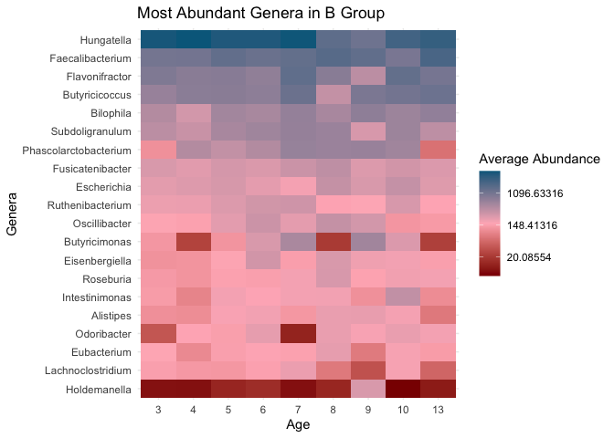

```r
getwd()
```

```
## [1] "/Users/Astrobeecal/Desktop/GitHub/BIS15L_Project_Group11/Berlin"
```


```r
library(tidyverse)
```

```
## ── Attaching packages ─────────────────────────────────────── tidyverse 1.3.0 ──
```

```
## ✓ ggplot2 3.3.3     ✓ purrr   0.3.4
## ✓ tibble  3.1.0     ✓ dplyr   1.0.4
## ✓ tidyr   1.1.2     ✓ stringr 1.4.0
## ✓ readr   1.4.0     ✓ forcats 0.5.1
```

```
## ── Conflicts ────────────────────────────────────────── tidyverse_conflicts() ──
## x dplyr::filter() masks stats::filter()
## x dplyr::lag()    masks stats::lag()
```

```r
library(janitor)
```

```
## 
## Attaching package: 'janitor'
```

```
## The following objects are masked from 'package:stats':
## 
##     chisq.test, fisher.test
```

```r
library(here)
```

```
## here() starts at /Users/Astrobeecal/Desktop/GitHub/BIS15L_Project_Group11
```


```r
microbiome_untidy <- read_csv(here("Berlin/Copy_files_csv/ASD meta abundance 2.csv"))
```

```
## 
## ── Column specification ────────────────────────────────────────────────────────
## cols(
##   .default = col_double(),
##   Taxonomy = col_character()
## )
## ℹ Use `spec()` for the full column specifications.
```


```r
microbiome_untidy <- janitor::clean_names(microbiome_untidy)
microbiome_untidy
```

```
## # A tibble: 5,619 x 61
##    taxonomy       a3    a5    a6    a9   a31   a51   a52   a53   a54   a59   a67
##    <chr>       <dbl> <dbl> <dbl> <dbl> <dbl> <dbl> <dbl> <dbl> <dbl> <dbl> <dbl>
##  1 g__Faecali…  4988  5060  2905  5745  4822  3889  4646  6337  5064  6359  3194
##  2 g__Hungate…  5803  5612  4109  1432  2652  4175  3891   894  4903  2970  4029
##  3 g__Clostri…  3793  2795  1355  5558  5383  3505  5541  4429  4121  3258  1901
##  4 g__Butyric…    64  1385   725  1553    40    53    33   175    58  1636  1170
##  5 g__Alistip…    15    20   723   620  3261    43    83    37    43  1114  2531
##  6 g__Unclass…   100    29    11  1320    51    45    52    64    60   896    26
##  7 g__Clostri…  2119  1230  1322  2675  1470  2262  2984  2004  1904  1227   821
##  8 g__Unclass…    12    24     1    44    26     9    25    19    17    17    15
##  9 g__Lachnoc…   453   691  2278   107   342  1304  1400  1207  2034  2051    20
## 10 g__Butyric…  1266  1682    43  1726  1804  1441  2691  1886   919  2215  1063
## # … with 5,609 more rows, and 49 more variables: a68 <dbl>, a69 <dbl>,
## #   a71 <dbl>, a73 <dbl>, a76 <dbl>, a78 <dbl>, a87 <dbl>, a89 <dbl>,
## #   a93 <dbl>, a101 <dbl>, a109 <dbl>, a113 <dbl>, a114 <dbl>, a115 <dbl>,
## #   a142 <dbl>, a144 <dbl>, a149 <dbl>, a164 <dbl>, a165 <dbl>, b1 <dbl>,
## #   b2 <dbl>, b3 <dbl>, b5 <dbl>, b6 <dbl>, b7 <dbl>, b8 <dbl>, b13 <dbl>,
## #   b14 <dbl>, b28 <dbl>, b29 <dbl>, b36 <dbl>, b37 <dbl>, b94 <dbl>,
## #   b99 <dbl>, b103 <dbl>, b106 <dbl>, b111 <dbl>, b114 <dbl>, b115 <dbl>,
## #   b120 <dbl>, b127 <dbl>, b132 <dbl>, b141 <dbl>, b142 <dbl>, b143 <dbl>,
## #   b152 <dbl>, b156 <dbl>, b158 <dbl>, b164 <dbl>
```


```r
microbiome_longer <- microbiome_untidy %>% 
  pivot_longer(-taxonomy, names_to = "condition", values_to = "abundance")%>% 
  filter(str_detect(taxonomy, "Unclassified") == FALSE) %>% 
  separate(condition, into = c("condition", "patient_id"), sep = 1) %>%
  separate(taxonomy, into = c("genus", "species"), sep = ";s__") %>% 
  separate(genus, into = c("trash", "genus"), sep = "__") %>% 
  separate(species, into = c("species", "strain"), sep = " sp. ") %>%
  separate(species, into = c("extra_genus", "species"), sep = " ") %>% 
  mutate(cultured = ifelse(extra_genus == "uncultured", FALSE, TRUE)) %>% 
  select(- extra_genus, - trash) %>% 
  mutate(species = ifelse(species == genus, NA, species))
```

```
## Warning: Expected 2 pieces. Missing pieces filled with `NA` in 182580 rows [1,
## 2, 3, 4, 5, 6, 7, 8, 9, 10, 11, 12, 13, 14, 15, 16, 17, 18, 19, 20, ...].
```

```
## Warning: Expected 2 pieces. Additional pieces discarded in 11640 rows [121, 122,
## 123, 124, 125, 126, 127, 128, 129, 130, 131, 132, 133, 134, 135, 136, 137, 138,
## 139, 140, ...].
```

```
## Warning: Expected 2 pieces. Missing pieces filled with `NA` in 95580 rows [301,
## 302, 303, 304, 305, 306, 307, 308, 309, 310, 311, 312, 313, 314, 315, 316, 317,
## 318, 319, 320, ...].
```

```r
microbiome_longer
```

```
## # A tibble: 279,720 x 7
##    genus            species     strain condition patient_id abundance cultured
##    <chr>            <chr>       <chr>  <chr>     <chr>          <dbl> <lgl>   
##  1 Faecalibacterium prausnitzii <NA>   a         3               4988 TRUE    
##  2 Faecalibacterium prausnitzii <NA>   a         5               5060 TRUE    
##  3 Faecalibacterium prausnitzii <NA>   a         6               2905 TRUE    
##  4 Faecalibacterium prausnitzii <NA>   a         9               5745 TRUE    
##  5 Faecalibacterium prausnitzii <NA>   a         31              4822 TRUE    
##  6 Faecalibacterium prausnitzii <NA>   a         51              3889 TRUE    
##  7 Faecalibacterium prausnitzii <NA>   a         52              4646 TRUE    
##  8 Faecalibacterium prausnitzii <NA>   a         53              6337 TRUE    
##  9 Faecalibacterium prausnitzii <NA>   a         54              5064 TRUE    
## 10 Faecalibacterium prausnitzii <NA>   a         59              6359 TRUE    
## # … with 279,710 more rows
```


```r
microbiome_avg_long <- microbiome_longer %>% 
  group_by(genus, condition) %>% 
  summarise(avg_abundance = mean(abundance, na.rm = T)) %>% 
  select(genus, condition, avg_abundance)
```

```
## `summarise()` has grouped output by 'genus'. You can override using the `.groups` argument.
```

```r
microbiome_avg_long
```

```
## # A tibble: 2,670 x 3
## # Groups:   genus [1,335]
##    genus               condition avg_abundance
##    <chr>               <chr>             <dbl>
##  1 Absidia             a                0.4   
##  2 Absidia             b                0.5   
##  3 Acaryochloris       a                0.0333
##  4 Acaryochloris       b                0.0667
##  5 Acetanaerobacterium a               15.2   
##  6 Acetanaerobacterium b               14.8   
##  7 Acetivibrio         a               22.6   
##  8 Acetivibrio         b               19.2   
##  9 Acetoanaerobium     a                0.8   
## 10 Acetoanaerobium     b                0.367 
## # … with 2,660 more rows
```


```r
microbiome_wider <- microbiome_avg_long %>% 
  pivot_wider(names_from = "condition", values_from = "avg_abundance")
microbiome_wider
```

```
## # A tibble: 1,335 x 3
## # Groups:   genus [1,335]
##    genus                     a       b
##    <chr>                 <dbl>   <dbl>
##  1 Absidia              0.4     0.5   
##  2 Acaryochloris        0.0333  0.0667
##  3 Acetanaerobacterium 15.2    14.8   
##  4 Acetivibrio         22.6    19.2   
##  5 Acetoanaerobium      0.8     0.367 
##  6 Acetobacter          2.06    0.778 
##  7 Acetobacterium       2.14    2.03  
##  8 Acetohalobium        0.1     0     
##  9 Acetomicrobium       0.2     0.217 
## 10 Acetonema            2.7     2.47  
## # … with 1,325 more rows
```


```r
microbiome_difference <- microbiome_wider %>% 
  group_by(genus) %>% 
  summarise(A = mean(a, na.rm = T), B = mean(b, na.rm = T)) %>% 
  mutate(difference = abs(A-B)) %>% 
  arrange(desc(difference))
microbiome_difference
```

```
## # A tibble: 1,335 x 4
##    genus                      A      B difference
##    <chr>                  <dbl>  <dbl>      <dbl>
##  1 Hungatella            3387.  3764.       378. 
##  2 Phascolarctobacterium  601.   353.       248. 
##  3 Holdemanella           113.    18.5       94.9
##  4 Butyricicoccus         705    797.        91.8
##  5 Butyricimonas          214.   132.        82.5
##  6 Paraprevotella          85.8   28.4       57.4
##  7 Bilophila              527.   470.        56.6
##  8 Sutterella              75.4   21.1       54.2
##  9 Escherichia            131.   176.        45.4
## 10 Odoribacter            165.   123.        41.9
## # … with 1,325 more rows
```


```r
microbiome_big_diff <- microbiome_difference %>%
  top_n(20)
```

```
## Selecting by difference
```

```r
microbiome_big_diff
```

```
## # A tibble: 20 x 4
##    genus                      A       B difference
##    <chr>                  <dbl>   <dbl>      <dbl>
##  1 Hungatella            3387.  3764.        378. 
##  2 Phascolarctobacterium  601.   353.        248. 
##  3 Holdemanella           113.    18.5        94.9
##  4 Butyricicoccus         705    797.         91.8
##  5 Butyricimonas          214.   132.         82.5
##  6 Paraprevotella          85.8   28.4        57.4
##  7 Bilophila              527.   470.         56.6
##  8 Sutterella              75.4   21.1        54.2
##  9 Escherichia            131.   176.         45.4
## 10 Odoribacter            165.   123.         41.9
## 11 Fusicatenibacter       226.   262.         36.7
## 12 Bacteroides             92.9   59.6        33.3
## 13 Flavonifractor         852.   885.         33.1
## 14 Subdoligranulum        400.   430.         30.0
## 15 Ruthenibacterium       200.   225.         24.8
## 16 Barnesiella             67.5   43.2        24.4
## 17 Faecalibacterium      1235.  1211.         24.2
## 18 Megamonas               50.1   27.5        22.7
## 19 Azospirillum            30.2    8.79       21.5
## 20 Parabacteroides         73.6   52.2        21.3
```
##Bar Graphs

```r
microbiome_big_diff %>% 
  select(genus, difference) %>% 
  group_by(genus) %>% 
  summarise(avg_difference = mean(difference)) %>% 
  ggplot(aes(x = reorder(genus, avg_difference), y = avg_difference))+
  geom_col(fill = "lightpink3")+
  coord_flip()+
  theme_minimal()+
  labs(title = "Difference Between Conditions in Highest Variable Genera", y = "Average Difference in Abundance", x = "Genus")
```

<!-- -->


```r
write.csv(microbiome_big_diff, file = "microbiome_big_diff.csv", row.names = FALSE)
```


```r
microbiome_big_diff_long <- microbiome_big_diff %>% 
  select(-difference) %>% 
  pivot_longer(c("A", "B"), names_to = "condition", values_to = "avg_abundance")
microbiome_big_diff_long
```

```
## # A tibble: 40 x 3
##    genus                 condition avg_abundance
##    <chr>                 <chr>             <dbl>
##  1 Hungatella            A                3387. 
##  2 Hungatella            B                3764. 
##  3 Phascolarctobacterium A                 601. 
##  4 Phascolarctobacterium B                 353. 
##  5 Holdemanella          A                 113. 
##  6 Holdemanella          B                  18.5
##  7 Butyricicoccus        A                 705  
##  8 Butyricicoccus        B                 797. 
##  9 Butyricimonas         A                 214. 
## 10 Butyricimonas         B                 132. 
## # … with 30 more rows
```


```r
mycol <- c("deepskyblue4", "darkred")
mycoln <- c("darkred", "lightpink", "deepskyblue4")
```


```r
microbiome_big_diff_long %>% 
  ggplot(aes(x = reorder(genus, avg_abundance), y = avg_abundance, fill = condition))+
  geom_col(position = "dodge")+
  coord_flip()+
  scale_fill_manual(values = mycol)+
  labs(title = "Abundance of Highest Variable Genera by Condition", y = "Average Abundance", x = "Genus", fill = "Condition")
```

<!-- -->


```r
microbiome_avg_long %>% 
  filter(avg_abundance > 114 | genus == "Odoribacter" | genus == "Parasutterella") %>%  
  ggplot(aes(x = reorder(genus, avg_abundance), y = avg_abundance, fill = condition))+
  geom_col(position = "dodge")+
  coord_flip()+
  scale_fill_manual(values = mycol)+
  labs(title = "Most Abundant Genera by Condition", y = "Average Abundance", x = "Genus", fill = "Condition")
```

<!-- -->


```r
write.csv(microbiome_big_diff_long, file = "microbiome_big_diff_long.csv", row.names = FALSE)
```

##Heat Maps

```r
microbiome_big_diff_long %>% 
  ggplot(aes(x = reorder(genus, avg_abundance) , y = condition))+
  geom_tile(aes(fill = avg_abundance, ))+
  coord_flip()+
  theme_minimal()+
  labs(title = "Abundance of Highest Variation Genera", x = "Genus", y = "Condition", fill = "Average Abundance")+
  scale_fill_gradientn(colours = mycoln, trans = "log")
```

<!-- -->


```r
microbiome_avg_long %>%
  filter(avg_abundance > 114 | genus == "Odoribacter" | genus == "Parasutterella") %>% 
  ggplot(aes(x = reorder(genus, avg_abundance) , y = condition))+
  geom_tile(aes(fill = avg_abundance))+
  coord_flip()+
  theme_minimal()+
  labs(title = "Most Abundant Genera", y = "Condition", x = "Genus", fill = "Average Abundance")+
  scale_fill_gradientn(colours = mycoln, trans = "log")
```

<!-- -->

```r
write.csv(microbiome_avg_long, file = "microbiome_avg_long.csv", row.names = FALSE)
```


##Age Heatmap

```r
demographics <- read_csv(here("Berlin/Copy_others/Ally/demographics_and_abundance copy.csv"))
```

```
## 
## ── Column specification ────────────────────────────────────────────────────────
## cols(
##   genus = col_character(),
##   sample_id = col_character(),
##   abundance = col_double(),
##   gender = col_character(),
##   age = col_double()
## )
```


```r
demographics_untidy <- demographics %>%
  separate(sample_id, into = c("condition", "patient_id"), sep = 1)
demographics_untidy
```

```
## # A tibble: 95,208 x 6
##    genus            condition patient_id abundance gender   age
##    <chr>            <chr>     <chr>          <dbl> <chr>  <dbl>
##  1 Faecalibacterium A         3               4988 Female     4
##  2 Faecalibacterium A         5               5060 Male       6
##  3 Faecalibacterium A         6               2905 Female     4
##  4 Faecalibacterium A         9               5745 Male      11
##  5 Faecalibacterium A         31              4822 Male       4
##  6 Faecalibacterium A         51              3889 Male       3
##  7 Faecalibacterium A         52              4646 Male       5
##  8 Faecalibacterium A         53              6337 Male       4
##  9 Faecalibacterium A         54              5064 Male       3
## 10 Faecalibacterium A         59              6359 Male       4
## # … with 95,198 more rows
```


```r
big_demographics_A <- demographics_untidy %>%
  filter(condition == "A") %>% 
  group_by(genus, age) %>% 
  summarise(avg_abundance = mean(abundance, na.rm = T)) %>% 
  arrange(desc(avg_abundance))
```

```
## `summarise()` has grouped output by 'genus'. You can override using the `.groups` argument.
```

```r
big_demographics_A
```

```
## # A tibble: 6,146 x 3
## # Groups:   genus [1,263]
##    genus              age avg_abundance
##    <chr>            <dbl>         <dbl>
##  1 Hungatella           6         4552.
##  2 Hungatella           3         3715.
##  3 Hungatella           5         3699.
##  4 Hungatella           4         3172.
##  5 Hungatella           7         2790.
##  6 Hungatella           8         2294 
##  7 Faecalibacterium     7         1977.
##  8 Hungatella           9         1892 
##  9 Faecalibacterium    11         1705.
## 10 Faecalibacterium     9         1563.
## # … with 6,136 more rows
```


```r
write.csv(big_demographics_A, file = "big_demographics_A.csv", row.names = FALSE)
```


```r
big_demographics_A %>%
  filter(genus == "Hungatella" | genus == "Faecalibacterium" | genus == "Phascolarctobacterium" | genus == "Flavonifractor" | genus == "Butyricicoccus" | genus == "Subdoligranulum" | genus == "Bilophila" | genus == "Butyricimonas" | genus == "Holdemanella" | genus == "Oscillibacter" | genus == "Fusicatenibacter" | genus == "Intestinimonas" | genus == "Ruthenibacterium" | genus == "Paraprevotella" | genus == "Escherichia" | genus == "Roseburia"| genus == "Eisenbergiella"| genus == "Alistipes"| genus == "Eubacterium"| genus == "Odoribacter") %>%
  ggplot(aes(x = reorder(genus, avg_abundance) , y = factor(age)))+
  geom_tile(aes(fill = avg_abundance))+
  coord_flip()+
  theme_minimal()+
  labs(title = "Most Abundant Genera in A Group", y = "Age", x = "Genus", fill = "Average Abundance")+
  scale_fill_gradientn(colours = mycoln, trans = "log")
```

<!-- -->


```r
big_demographics_B <- demographics_untidy %>%
  filter(condition == "B") %>% 
  group_by(genus, age) %>% 
  summarise(avg_abundance = mean(abundance, na.rm = T)) %>% 
  arrange(desc(avg_abundance))
```

```
## `summarise()` has grouped output by 'genus'. You can override using the `.groups` argument.
```

```r
big_demographics_B
```

```
## # A tibble: 5,559 x 3
## # Groups:   genus [1,100]
##    genus              age avg_abundance
##    <chr>            <dbl>         <dbl>
##  1 Hungatella           4         4408.
##  2 Hungatella           7         4303 
##  3 Hungatella           3         4030.
##  4 Hungatella           6         3705.
##  5 Hungatella           5         3680.
##  6 Hungatella          13         2829 
##  7 Hungatella          10         2325 
##  8 Faecalibacterium    13         2146.
##  9 Faecalibacterium     8         1724.
## 10 Hungatella           8         1556 
## # … with 5,549 more rows
```


```r
write.csv(big_demographics_B, file = "big_demographics_B.csv", row.names = FALSE)
```


```r
big_demographics_B %>%
  filter(genus == "Hungatella" | genus == "Faecalibacterium" | genus == "Phascolarctobacterium" | genus == "Flavonifractor" | genus == "Butyricicoccus" | genus == "Subdoligranulum" | genus == "Bilophila" | genus == "Butyricimonas" | genus == "Holdemanella" | genus == "Oscillibacter" | genus == "Fusicatenibacter" | genus == "Intestinimonas" | genus == "Ruthenibacterium" | genus == "Lachnoclostridium" | genus == "Escherichia" | genus == "Roseburia"| genus == "Eisenbergiella"| genus == "Alistipes"| genus == "Eubacterium"| genus == "Odoribacter") %>%
  ggplot(aes(x = reorder(genus, avg_abundance) , y = factor(age)))+
  geom_tile(aes(fill = avg_abundance))+
  coord_flip()+
  theme_minimal()+
  labs(title = "Most Abundant Genera in B Group", y = "Age", x = "Genera", fill = "Average Abundance")+
  scale_fill_gradientn(colours = mycoln, trans = "log")
```

<!-- -->
