---
# Differences in the Human Gut Microbiome in Children with Autism Spectrum Disorder

The study by Zhou Dan et al. examines the abundances of different gut microbiome species in patients with Autism Spectrum Disorder (ASD) and without (TD). We used bar graphs, presented in a Shiny App, Venn diagrams, and heat maps, to compare the microbiome diversity of these two cohorts.


### Loading the libraries

```r
library(tidyverse)
```

```
## ── Attaching packages ─────────────────────────────────────── tidyverse 1.3.0 ──
```

```
## ✓ ggplot2 3.3.3     ✓ purrr   0.3.4
## ✓ tibble  3.1.0     ✓ dplyr   1.0.4
## ✓ tidyr   1.1.2     ✓ stringr 1.4.0
## ✓ readr   1.4.0     ✓ forcats 0.5.1
```

```
## ── Conflicts ────────────────────────────────────────── tidyverse_conflicts() ──
## x dplyr::filter() masks stats::filter()
## x dplyr::lag()    masks stats::lag()
```

```r
library(janitor)
```

```
## 
## Attaching package: 'janitor'
```

```
## The following objects are masked from 'package:stats':
## 
##     chisq.test, fisher.test
```

```r
library(here)
```

```
## here() starts at /Users/Astrobeecal/Desktop/BIS15L_Project_Group11
```

```r
library(naniar)
library(ggvenn)
```

```
## Loading required package: grid
```

```r
library(VennDiagram)
```

```
## Loading required package: futile.logger
```

```r
library(shiny)
library(shinydashboard)
```

```
## 
## Attaching package: 'shinydashboard'
```

```
## The following object is masked from 'package:graphics':
## 
##     box
```

```r
library(ggplot2)
library(purrr)
library(dplyr)
```

### Loading the .csv files

```r
ASD_meta_adundance <- read_csv(here("Final Project/Copy_others copy/Ally/ASD_meta_abundance_2 copy.csv"))
```

```
## 
## ── Column specification ────────────────────────────────────────────────────────
## cols(
##   .default = col_double(),
##   Taxonomy = col_character()
## )
## ℹ Use `spec()` for the full column specifications.
```

```r
microbiome_diversity <- read_csv(here("Final Project/Copy_others copy/Ally/microbiome_diversity copy.csv"))
```

```
## 
## ── Column specification ────────────────────────────────────────────────────────
## cols(
##   group = col_character(),
##   n_genus = col_double(),
##   n_species = col_double()
## )
```

```r
asd_group_tidier <- read_csv(here("Final Project/Copy_others copy/Ally/asd_group_tidier copy.csv"))
```

```
## 
## ── Column specification ────────────────────────────────────────────────────────
## cols(
##   genus = col_character(),
##   species = col_character(),
##   strain = col_character(),
##   condition = col_character(),
##   patient_id = col_double(),
##   abundance = col_double(),
##   cultured = col_logical()
## )
```

```r
td_group_tidier <- read_csv(here("Final Project/Copy_others copy/Ally/td_group_tidier copy.csv"))
```

```
## 
## ── Column specification ────────────────────────────────────────────────────────
## cols(
##   genus = col_character(),
##   species = col_character(),
##   strain = col_character(),
##   condition = col_character(),
##   patient_id = col_double(),
##   abundance = col_double(),
##   cultured = col_logical()
## )
```

```r
demographics_and_abundance <- read_csv(here("Final Project/Copy_others copy/Ally/demographics_and_abundance copy.csv"))
```

```
## 
## ── Column specification ────────────────────────────────────────────────────────
## cols(
##   genus = col_character(),
##   sample_id = col_character(),
##   abundance = col_double(),
##   gender = col_character(),
##   age = col_double()
## )
```

```r
demo_venn <- read_csv(here("Final Project/Copy_others copy/Ally/demo_venn copy.csv"))
```

```
## 
## ── Column specification ────────────────────────────────────────────────────────
## cols(
##   genus = col_character(),
##   gender = col_character()
## )
```

```r
asd_B2 <- read_csv(here("Final Project/Copy_others copy/Ally/asd_B2 copy.csv"))
```

```
## 
## ── Column specification ────────────────────────────────────────────────────────
## cols(
##   tax_asd = col_character(),
##   condition = col_character(),
##   patient_id = col_double(),
##   abundance = col_double()
## )
```

```r
td_A2 <- read_csv(here("Final Project/Copy_others copy/Ally/td_A2 copy.csv"))
```

```
## 
## ── Column specification ────────────────────────────────────────────────────────
## cols(
##   tax_td = col_character(),
##   condition = col_character(),
##   patient_id = col_double(),
##   abundance = col_double()
## )
```

```r
asd2 <- read_csv(here("Final Project/Copy_others copy/Ally/asd2 copy.csv"))
```

```
## 
## ── Column specification ────────────────────────────────────────────────────────
## cols(
##   genus = col_character(),
##   sample_id = col_character(),
##   abundance = col_double()
## )
```

```r
demographics2 <- read_csv(here("Final Project/Copy_others copy/Ally/demographics2 copy.csv"))
```

```
## 
## ── Column specification ────────────────────────────────────────────────────────
## cols(
##   sample_id = col_character(),
##   gender = col_character(),
##   age = col_double()
## )
```

```r
microbiome_big_diff_long <- read_csv(here("Final Project/Copy_others copy/Claire/microbiome_big_diff_long copy.csv"))
```

```
## 
## ── Column specification ────────────────────────────────────────────────────────
## cols(
##   genus = col_character(),
##   condition = col_character(),
##   avg_abundance = col_double()
## )
```

```r
microbiome_avg_long <- read_csv(here("Final Project/Copy_others copy/Claire/microbiome_avg_long copy.csv"))
```

```
## 
## ── Column specification ────────────────────────────────────────────────────────
## cols(
##   genus = col_character(),
##   condition = col_character(),
##   avg_abundance = col_double()
## )
```

```r
big_demographics_A <- read_csv(here("Final Project/Copy_others copy/Claire/big_demographics_A copy.csv"))
```

```
## 
## ── Column specification ────────────────────────────────────────────────────────
## cols(
##   genus = col_character(),
##   age = col_double(),
##   avg_abundance = col_double()
## )
```

```r
big_demographics_B <- read_csv(here("Final Project/Copy_others copy/Claire/big_demographics_B copy.csv"))
```

```
## 
## ── Column specification ────────────────────────────────────────────────────────
## cols(
##   genus = col_character(),
##   age = col_double(),
##   avg_abundance = col_double()
## )
```
# Shiny


## Graphs comparing Genus and Species

```r
ui <- fluidPage(    
  
  titlePanel("Abundance Comparison"),
  
  sidebarLayout(      
    
    sidebarPanel(
      selectInput("x", "Select X Variable", choices = c("group"), selected = "group"),
      selectInput("y", "Select Y Variable", choices = c("n_genus", "n_species"), selected = "n_genus"),
      
      hr(),
      helpText("Reference: Zhou Dan, et al. (2020) Altered gut microbial profile is associated with abnormal metabolism activity of Autism Spectrum Disorder, Gut Microbes, 11:5, 1246-1267, DOI: 10.1080/19490976.2020.1747329
")
    ),
    
    mainPanel(
      plotOutput("Plot")  
    )
    
  )
)

server <- function(input, output) {
  
  output$Plot <- renderPlot({
    
    ggplot(microbiome_diversity, aes_string(x = input$x, y = input$y, fill= "group")) + geom_col(position = "dodge") + theme(axis.text.x = element_text()) + theme(plot.title = element_text(size = rel(1.5)))+ scale_fill_manual(values = c("darkred","skyblue4"))
  })
  }

shinyApp(ui, server)
```

## Graphs of Abundance Versus Demographics

```r
ui <- dashboardPage(
  dashboardHeader(title = "Abundance Versus Demographics"),
  dashboardSidebar(),
  dashboardBody(
  selectInput("x", "Select X Variable", choices = c("age", "gender"), selected = "age"),
  selectInput("y", "Select Y Variable", choices = c("abundance"), selected = "abundance"),
  plotOutput("plot", width = "500px", height = "400px"))
)

server <- function(input, output, session) { 
  output$plot <- renderPlot({
  ggplot(demographics_and_abundance, aes_string(x = input$x, y = input$y, fill= as.factor("abundance"))) + geom_col(position = "dodge") + theme(axis.text.x = element_text()) + theme(plot.title = element_text(size = rel(1.5)))+ scale_fill_manual(values = "darkred")
  })
  session$onSessionEnded(stopApp)
  }
shinyApp(ui, server)
```


# Venn Diagrams of Data

## Building Venn Diagram that compares unique species composition between ASD and TD patients

```r
species_venn_data2 <- list(
  "TD Species" = td_A2$tax_td,
  "ASD Species" = asd_B2$tax_asd
)
```


## General Comparison of unique species composition between ASD and TD patients

```r
ggvenn(species_venn_data2, fill_color = c("darkred", "deepskyblue4"))
```

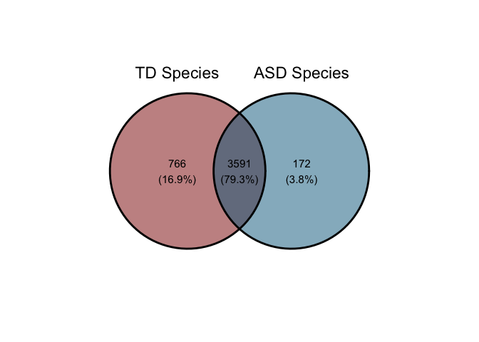<!-- -->


## General Comparison of unique species composition between ASD and TD patients to Scale

```r
grid.newpage()
draw.pairwise.venn(area1 = (766+3591),                      
                   area2 = (172 + 3591),
                   cross.area = 3591, 
                   fill = c("darkred", "deepskyblue4"), 
                   category = c("TD Species", "ASD Species"))
```

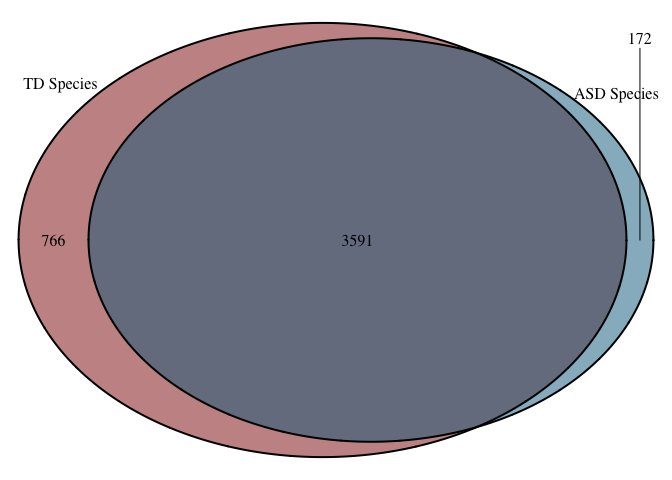<!-- -->

```
## (polygon[GRID.polygon.25], polygon[GRID.polygon.26], polygon[GRID.polygon.27], polygon[GRID.polygon.28], text[GRID.text.29], text[GRID.text.30], lines[GRID.lines.31], text[GRID.text.32], text[GRID.text.33], text[GRID.text.34])
```


## Preparation of data for Venn Diagrams that compares genera composition between ASD and TD patients

### Preparing TD data:

```r
td_venn <- td_group_tidier %>%
  rename(genus_td = "genus") %>% 
  filter(abundance != 0) %>% 
  select(genus_td, patient_id)
```

### Preparing ASD data:

```r
asd_venn <-
  asd_group_tidier %>% 
  rename(genus_asd = "genus") %>% 
  filter(abundance != 0)
```

### Joining TD and ASD data:

```r
both_venn <- full_join(td_venn, asd_venn, by = "patient_id")
both_venn
```

```
## # A tibble: 19,470,923 x 8
##    genus_td   patient_id genus_asd  species  strain condition abundance cultured
##    <chr>           <dbl> <chr>      <chr>    <chr>  <chr>         <dbl> <lgl>   
##  1 Faecaliba…          3 Faecaliba… prausni… <NA>   b              4499 TRUE    
##  2 Faecaliba…          3 Hungatella hathewa… <NA>   b              2325 TRUE    
##  3 Faecaliba…          3 Clostridi… <NA>     <NA>   b              3842 FALSE   
##  4 Faecaliba…          3 Butyricim… virosa   <NA>   b               703 TRUE    
##  5 Faecaliba…          3 Alistipes  indisti… <NA>   b               819 TRUE    
##  6 Faecaliba…          3 Clostridi… <NA>     CAG:7  b              1504 TRUE    
##  7 Faecaliba…          3 Lachnoclo… asparag… <NA>   b              2208 TRUE    
##  8 Faecaliba…          3 Butyricic… <NA>     <NA>   b              2209 FALSE   
##  9 Faecaliba…          3 Oscilliba… <NA>     ER4    b               193 TRUE    
## 10 Faecaliba…          3 Desulfovi… piger    <NA>   b                 3 TRUE    
## # … with 19,470,913 more rows
```


```r
both_venn$genus_td <- as.factor(both_venn$genus_td)
both_venn$genus_asd <- as.factor(both_venn$genus_asd)
```


```r
both_venn2 <- 
  both_venn %>% 
  filter(genus_td != "NA" | genus_asd != "NA")
```


### Building Venn Diagram that compares genera composition between ASD and TD patients

```r
venn_data <- list(
  "TD Genera" = both_venn2$genus_td,
  "ASD Genera" = both_venn2$genus_asd
)
```


## General Comparison of Genome Overlap between ASD and TD patients

```r
ggvenn(venn_data, fill_color = c("darkred", "deepskyblue4"))
```

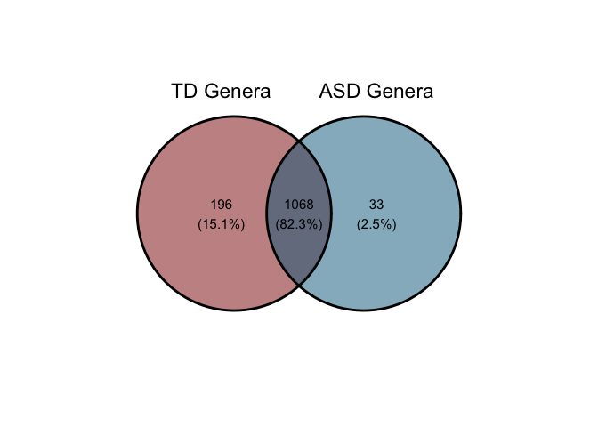<!-- -->
## General Comparison of Genome Overlap between ASD and TD patients to Scale

```r
grid.newpage()
draw.pairwise.venn(area1 = 1264,                      
                   area2 = 1101,
                   cross.area = 1068, 
                   fill = c("darkred", "deepskyblue4"), 
                   category = c("TD Genera", "ASD Genera"))
```

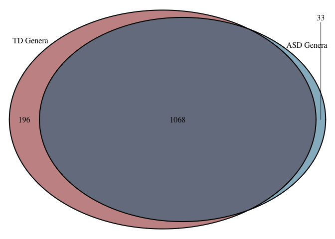<!-- -->

```
## (polygon[GRID.polygon.59], polygon[GRID.polygon.60], polygon[GRID.polygon.61], polygon[GRID.polygon.62], text[GRID.text.63], text[GRID.text.64], lines[GRID.lines.65], text[GRID.text.66], text[GRID.text.67], text[GRID.text.68])
```


### Preparation of data for Venn Diagrams that compares genera composition between gender

```r
demo_venn
```

```
## # A tibble: 95,208 x 2
##    genus            gender
##    <chr>            <chr> 
##  1 Faecalibacterium Female
##  2 Faecalibacterium Male  
##  3 Faecalibacterium Female
##  4 Faecalibacterium Male  
##  5 Faecalibacterium Male  
##  6 Faecalibacterium Male  
##  7 Faecalibacterium Male  
##  8 Faecalibacterium Male  
##  9 Faecalibacterium Male  
## 10 Faecalibacterium Male  
## # … with 95,198 more rows
```
### Dividing genera by gender

```r
demo_venn_f <- 
  demo_venn %>% 
  filter(gender == "Female") %>% 
  rename(genus_f = "genus")
demo_venn_f
```

```
## # A tibble: 5,091 x 2
##    genus_f          gender
##    <chr>            <chr> 
##  1 Faecalibacterium Female
##  2 Faecalibacterium Female
##  3 Faecalibacterium Female
##  4 Faecalibacterium Female
##  5 Hungatella       Female
##  6 Hungatella       Female
##  7 Hungatella       Female
##  8 Hungatella       Female
##  9 Clostridium      Female
## 10 Clostridium      Female
## # … with 5,081 more rows
```

```r
demo_venn_m <-
  demo_venn %>% 
  filter(gender == "Male") %>% 
  rename(genus_m = "genus")
demo_venn_m
```

```
## # A tibble: 90,117 x 2
##    genus_m          gender
##    <chr>            <chr> 
##  1 Faecalibacterium Male  
##  2 Faecalibacterium Male  
##  3 Faecalibacterium Male  
##  4 Faecalibacterium Male  
##  5 Faecalibacterium Male  
##  6 Faecalibacterium Male  
##  7 Faecalibacterium Male  
##  8 Faecalibacterium Male  
##  9 Faecalibacterium Male  
## 10 Faecalibacterium Male  
## # … with 90,107 more rows
```

```r
demo_venn_f$genus_f <- as.factor(demo_venn_f$genus_f)
demo_venn_m$genus_m <- as.factor(demo_venn_m$genus_m)
```

## General Comparison of Genome Overlap between Gender

```r
demo_venn_data <- list(
  "Male Genera" = demo_venn_m$genus_m,
  "Female Genera" = demo_venn_f$genus_f
)
```


```r
ggvenn(demo_venn_data, fill_color = c("darkred", "deepskyblue4"))
```

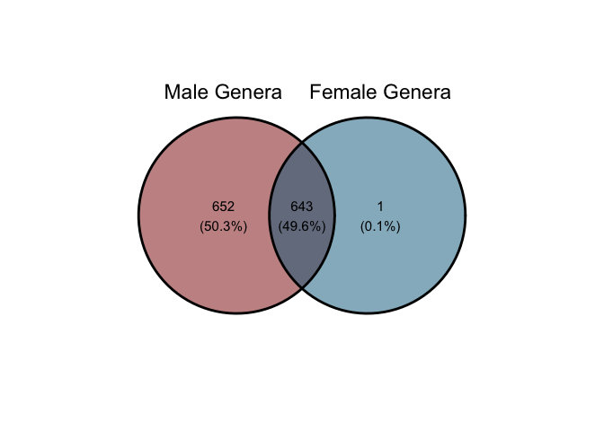<!-- -->

## General Comparison of Genome Overlap between Gender to Scale

```r
grid.newpage()
draw.pairwise.venn(area1 = 652+643,                      
                   area2 = 644,
                   cross.area = 643, 
                   fill = c("darkred", "deepskyblue4"), 
                   category = c("Male Genera", "Female Genera"))
```

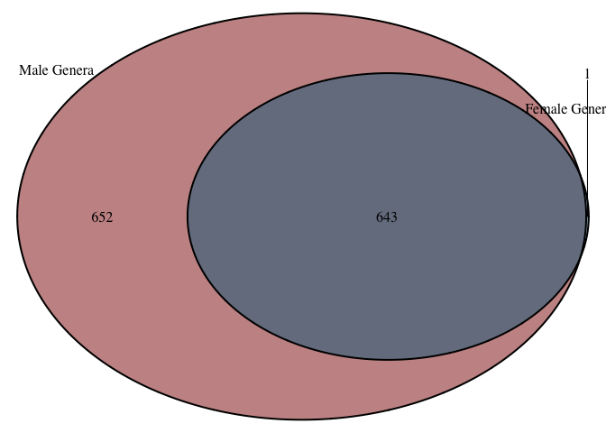<!-- -->

```
## (polygon[GRID.polygon.93], polygon[GRID.polygon.94], polygon[GRID.polygon.95], polygon[GRID.polygon.96], text[GRID.text.97], text[GRID.text.98], lines[GRID.lines.99], text[GRID.text.100], text[GRID.text.101], text[GRID.text.102])
```

### Preparation of data for Venn Diagrams that compares genera composition between age groups

```r
age_venn <- full_join(asd2, demographics2, by = "sample_id") %>% 
  select(-c(sample_id, abundance, gender)) %>% 
  mutate(age = case_when(age <= 7 ~ "younger",
                         age > 7 ~ "older"))
age_venn$genus <- as.factor(age_venn$genus)
age_venn_y <-
  age_venn %>% 
  filter(age == "younger") %>% 
  rename(genus_y = "genus")

age_venn_o <-
  age_venn %>% 
  filter(age == "older") %>% 
  rename(genus_o = "genus")
```

## General Comparison of Genome Overlap between age groups

```r
age_venn_data <- list(
  "Younger Genera" = age_venn_y$genus_y,
  "Older Genera" = age_venn_o$genus_o
)
```


```r
ggvenn(age_venn_data, fill_color = c("darkred", "deepskyblue4"))
```

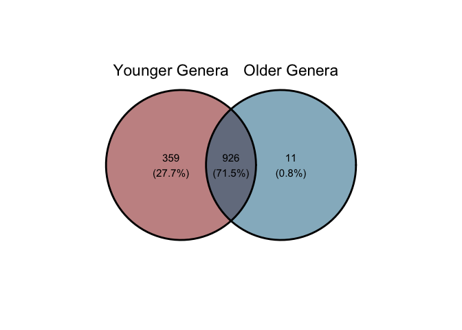<!-- -->

## General Comparison of Genome Overlap between age groups to Scale

```r
grid.newpage()
draw.pairwise.venn(area1 = 359+926,                      
                   area2 = 926+11,
                   cross.area = 926, 
                   fill = c("darkred", "deepskyblue4"), 
                   category = c("Younger Genera", "Older Genera"))
```

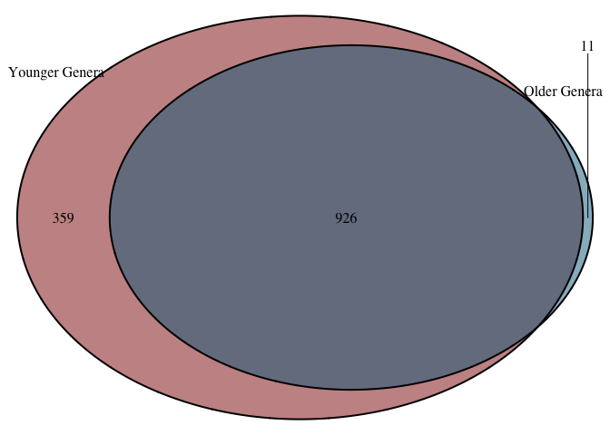<!-- -->

```
## (polygon[GRID.polygon.127], polygon[GRID.polygon.128], polygon[GRID.polygon.129], polygon[GRID.polygon.130], text[GRID.text.131], text[GRID.text.132], lines[GRID.lines.133], text[GRID.text.134], text[GRID.text.135], text[GRID.text.136])
```


# Heatmaps

### Colors used:

```r
mycol <- c("deepskyblue4", "darkred")
mycoln <- c("darkred", "lightpink", "deepskyblue4")
```

## Heatmap of difference between “a” and “b” for each high variation genera

```r
microbiome_big_diff_long %>% 
  ggplot(aes(x = reorder(genus, avg_abundance) , y = condition))+
  geom_tile(aes(fill = avg_abundance, ))+
  coord_flip()+
  theme_minimal()+
  labs(title = "Abundance of Highest Variation Genera", x = "Genus", y = "Condition", fill = "Average Abundance")+
  scale_fill_gradientn(colours = mycoln, trans = "log")
```

<!-- -->


## Heatmap of the 20 most abundant genera

```r
microbiome_avg_long %>%
  filter(avg_abundance > 114 | genus == "Odoribacter" | genus == "Parasutterella") %>% 
  ggplot(aes(x = reorder(genus, avg_abundance) , y = condition))+
  geom_tile(aes(fill = avg_abundance))+
  coord_flip()+
  theme_minimal()+
  labs(title = "Most Abundant Genera", y = "Condition", x = "Genus", fill = "Average Abundance")+
  scale_fill_gradientn(colours = mycoln, trans = "log")
```

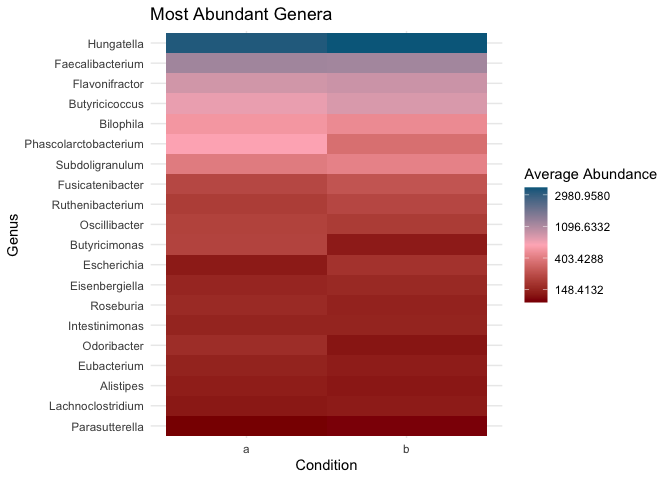<!-- -->

# Age Heatmaps


## Heatmap of the 20 most abundant genera in group A

```r
big_demographics_A %>%
  filter(genus == "Hungatella" | genus == "Faecalibacterium" | genus == "Phascolarctobacterium" | genus == "Flavonifractor" | genus == "Butyricicoccus" | genus == "Subdoligranulum" | genus == "Bilophila" | genus == "Butyricimonas" | genus == "Holdemanella" | genus == "Oscillibacter" | genus == "Fusicatenibacter" | genus == "Intestinimonas" | genus == "Ruthenibacterium" | genus == "Paraprevotella" | genus == "Escherichia" | genus == "Roseburia"| genus == "Eisenbergiella"| genus == "Alistipes"| genus == "Eubacterium"| genus == "Odoribacter") %>%
  ggplot(aes(x = reorder(genus, avg_abundance) , y = factor(age)))+
  geom_tile(aes(fill = avg_abundance))+
  coord_flip()+
  theme_minimal()+
  labs(title = "Most Abundant Genera in A Group", y = "Age", x = "Genus", fill = "Average Abundance")+
  scale_fill_gradientn(colours = mycoln, trans = "log")
```

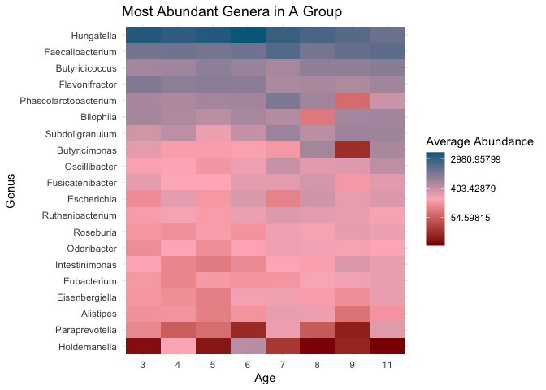<!-- -->


## Heatmap of the 20 most abundant genera in group B

```r
big_demographics_B %>%
  filter(genus == "Hungatella" | genus == "Faecalibacterium" | genus == "Phascolarctobacterium" | genus == "Flavonifractor" | genus == "Butyricicoccus" | genus == "Subdoligranulum" | genus == "Bilophila" | genus == "Butyricimonas" | genus == "Holdemanella" | genus == "Oscillibacter" | genus == "Fusicatenibacter" | genus == "Intestinimonas" | genus == "Ruthenibacterium" | genus == "Lachnoclostridium" | genus == "Escherichia" | genus == "Roseburia"| genus == "Eisenbergiella"| genus == "Alistipes"| genus == "Eubacterium"| genus == "Odoribacter") %>%
  ggplot(aes(x = reorder(genus, avg_abundance) , y = factor(age)))+
  geom_tile(aes(fill = avg_abundance))+
  coord_flip()+
  theme_minimal()+
  labs(title = "Most Abundant Genera in B Group", y = "Age", x = "Genera", fill = "Average Abundance")+
  scale_fill_gradientn(colours = mycoln, trans = "log")
```

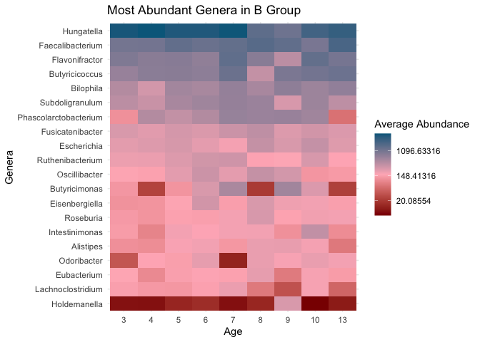<!-- -->

# Conclusion
1. The amount of both genera and species is consistently higher in the TD group than the ASD group.

2. The genera abundance, while somewhat fluctuating, shows a slight decrease, then increase as the age increases. The genera abundance for males have also been shown to be higher than females in this data set.

3. The typically developing group had greater diversity of genera and species. Across both groups, there was greater genus diversity in males and younger individuals compared to females and older individuals, respectively.

4. The heat maps show a logarithmic trend in abundance of genera in individuals in both conditions, with few genera representing the most abundant genera.

5. The heat maps also show no noticeable trend in abundance with age in either condition but a trend towards decreasing abundance in the TD group compared to the ASD group in the select genera we explored.
